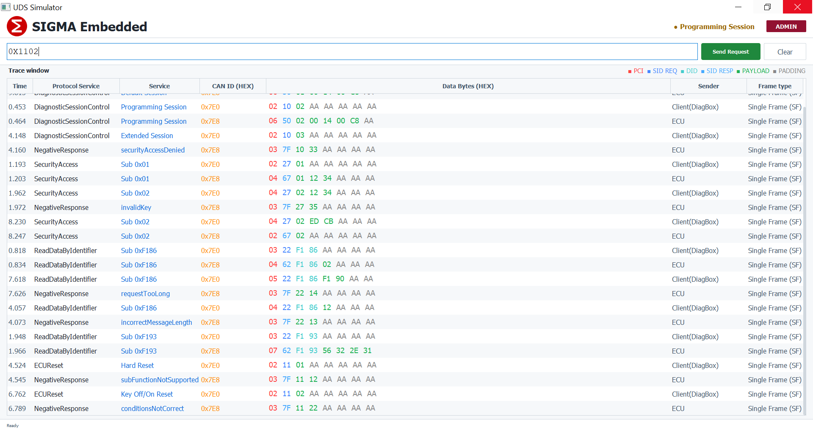

# UDS Simulator — ISO 14229

> Pure software UDS diagnostic simulator built with Python & PyQt5.  
> Simulates an ECU responding to diagnostic requests with real-time frame tracing.


---

## Installation

```bash
pip install PyQt5
```

---

## Supported UDS Services

| SID | Service | Description |
|-----|---------|-------------|
| `0x10` | DiagnosticSessionControl | Switch between Default / Extended / Programming |
| `0x11` | ECUReset | Hard / Key Off / Soft reset |
| `0x22` | ReadDataByIdentifier | Read DID value from ECU |
| `0x27` | SecurityAccess | Seed/Key authentication (XOR 0xFF) |

---

## Diagnostic Sessions

| Session | Code | Condition |
|---------|------|-----------|
| Default | `0x01` | No condition |
| Extended | `0x03` | Security must be unlocked |
| Programming | `0x02` | Security unlocked + Engine Temp < 20°C |

---

## NRC Codes

| NRC | Name | Trigger |
|-----|------|---------|
| `0x10` | generalReject | Invalid SID (1 hex char) |
| `0x11` | serviceNotSupported | SID not in valid list |
| `0x12` | subFunctionNotSupported | Invalid sub-function |
| `0x13` | incorrectMessageLength | Wrong byte count |
| `0x14` | requestTooLong | Multiple DIDs in one request |
| `0x22` | conditionsNotCorrect | VIN read while speed != 0 |
| `0x24` | requestSequenceError | Key sent before seed |
| `0x31` | requestOutOfRange | DID not in database |
| `0x33` | securityAccessDenied | Security not unlocked |
| `0x35` | invalidKey | Wrong key sent |
| `0x7E` | subFunctionNotSupportedInActiveSession | Sub-function not allowed in session |
| `0x7F` | serviceNotSupportedInActiveSession | Service not allowed in session |

---

## DID Database

| DID | Name | Type | R | W | Roles |
|-----|------|------|---|---|-------|
| `0xF40D` | Vehicle Speed | uint8 | ✓ | ✗ | All |
| `0xF405` | Engine Coolant Temp | uint8 | ✓ | ✗ | All |
| `0xF406` | Engine RPM | uint16 | ✓ | ✗ | All |
| `0xF190` | VIN | string | ✓ | ✓ | Admin |
| `0xF18C` | ECU Serial Number | string | ✓ | ✗ | Admin, Tech |
| `0xF186` | Active Session | uint8 | ✓ | ✗ | All |
| `0xF187` | SW Version | string | ✓ | ✗ | All |
| `0xF193` | HW Version | string | ✓ | ✗ | All |


---

## User Roles

| Role | Password | Read | Write | Session | Reset | Security |
|------|----------|------|-------|---------|-------|----------|
| `admin` | admin123 | ✓ | ✓ | ✓ | ✓ | ✓ |
| `technician` | tech456 | ✓ | ✓ | ✓ | ✓ | ✗ |
| `reader` | read789 | ✓ | ✗ | ✗ | ✗ | ✗ |

---

## Security Access Flow

```
1. Send seed request  →  0x2701
2. ECU responds       →  67 01 12 34
3. Calculate key      →  key = seed XOR 0xFF  →  ED CB
4. Send key           →  0x270200EDCB
5. ECU grants access  →  67 02
```

---

## Command Input Examples

| Command | Description |
|---------|-------------|
| `0x1001` | Default Session |
| `0x1003` | Extended Session |
| `0x1002` | Programming Session |
| `0x1101` | Hard Reset |
| `0x1103` | Soft Reset |
| `0x22F40D` | Read Vehicle Speed |
| `0x22F190` | Read VIN |
| `0x2701` | Request Security Seed |
| `0x270200EDCB` | Send Security Key |

---